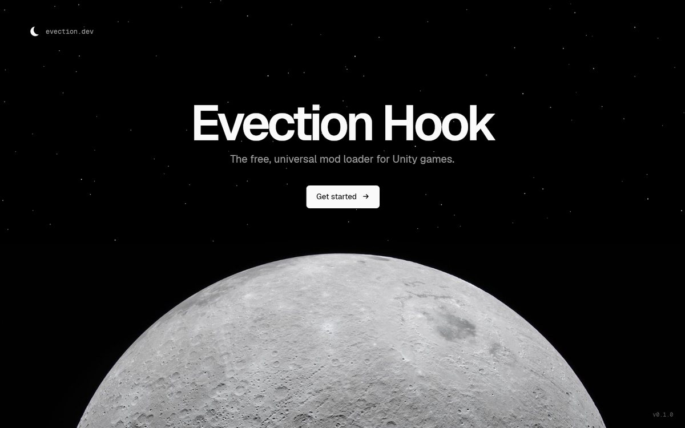
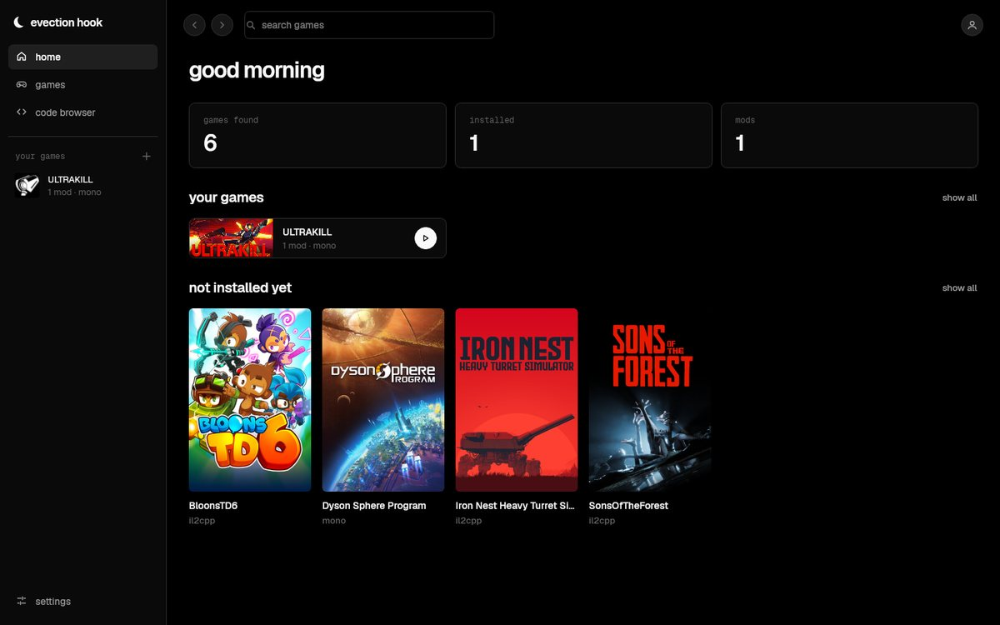
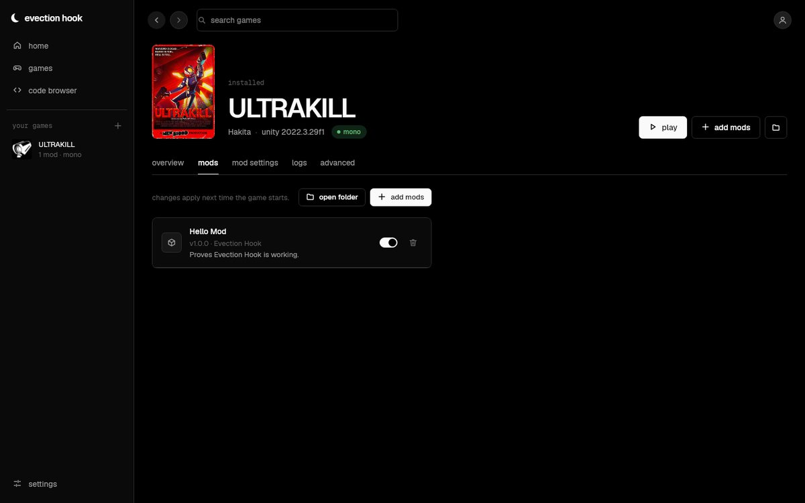
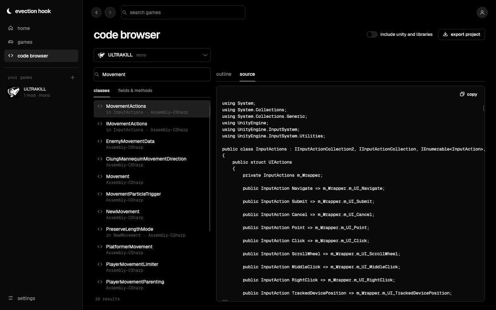

# Evection Hook

**A free, universal mod loader for Unity games — for players who just want mods to work, and modders who want to see how a game works.**

- **One tool for every Unity game.** Detects Mono vs IL2CPP, 32 vs 64-bit and the Unity version for you.
- **No setup knowledge needed.** Pick a game, install, drop mods into a folder.
- **Built-in game code browser.** Search, inspect and decompile any Unity game's code to find what to mod.
- **Free forever.** MIT licensed. Nobody should have to pay for a mod loader.
- **Safe by design.** Refuses games with anti-cheat, never touches files outside the game folder, and uninstalls cleanly.



> **Status: early development (v0.1).** The desktop app, CLI, game detection, installer and code browser work.
> Mono games load mods (verified in ULTRAKILL); IL2CPP mod loading is in progress — see the [roadmap](docs/roadmap.md).

| | Mono games | IL2CPP games |
|---|:---:|:---:|
| Detect & install | ✅ | 🚧 runtime in progress |
| Load mods | ✅ | 🚧 |
| Browse / search / decompile code | ✅ full source | ✅ signatures (no method bodies) |

| Home | A game's mods | Code browser |
|---|---|---|
|  |  |  |

## For players

1. Download the latest release for your OS from [Releases](../../releases), unzip it, and open **EvectionHook**. Nothing else to install — see [DEPENDENCIES.md](DEPENDENCIES.md).
2. Pick your game → **install**.
3. **Add mods** (or drag `.dll` files onto the mods tab), then hit **play**.

Want the normal game when you launch from Steam, and mods only when you hit play in Evection Hook?
Turn on *settings → general → only load mods when launched from evection hook*.

**Linux / Steam Deck (Proton):** the game's Overview tab shows the launch option to paste into Steam
(`WINEDLLOVERRIDES="winhttp=n,b" %command%`) with a Copy button.

Something wrong? The game's **Logs** tab shows what happened. Removing Evection Hook is one button, and it leaves the game folder exactly as it was.

Prefer a terminal? Everything is also in the `evection` command:

```sh
evection scan                          # lists your Unity games
evection install "ULTRAKILL"           # a Steam game name, a folder, or the game's .exe
evection mods "ULTRAKILL" add MyMod.dll
evection play "ULTRAKILL"              # start with mods on
evection uninstall "ULTRAKILL"
```

## For modders

The app's **code browser** lets you search a game's classes, fields and methods, read decompiled source, and export the
whole game as a C# project. Same from the CLI:

```sh
evection search "Sons Of The Forest" health     # find classes, fields and methods by name
evection inspect ULTRAKILL NewMovement          # every field, property and method of a class
evection source ULTRAKILL NewMovement           # decompiled C# of a class
evection dump ULTRAKILL --out ./ultrakill-src   # whole game as a C# project for VS Code / Rider
```

Then write a mod: see [docs/writing-mods.md](docs/writing-mods.md) and [examples/HelloMod](examples/HelloMod).

```csharp
[ModInfo("Infinite Health", "1.0.0", "You")]
public class InfiniteHealth : EvectionMod
{
    public override void OnLoad() => Harmony.PatchAll(typeof(InfiniteHealth).Assembly);
}
```

## Building from source

Requires the .NET 8 SDK and bash — full list in [DEPENDENCIES.md](DEPENDENCIES.md).

```sh
tools/fetch-deps.sh          # downloads UnityDoorstop and Cpp2IL into deps/
dotnet build                 # builds everything
dotnet test                  # runs the tests
tools/build-payload.sh       # produces artifacts/release/<platform>/ — a ready-to-ship folder
dotnet run --project src/Evection.GUI                                   # run the app
dotnet run --project tools/Evection.GUI.Snapshots -- snapshots          # render every screen to PNG
```

See [docs/architecture.md](docs/architecture.md) for how it works and [CONTRIBUTING.md](CONTRIBUTING.md) to help out.

## Anti-cheat policy

Evection Hook won't install into games that ship anti-cheat (Easy Anti-Cheat, BattlEye, etc.), and will never include anti-cheat bypasses.
Please don't use mods to ruin other people's multiplayer games. Details: [docs/anti-cheat-policy.md](docs/anti-cheat-policy.md).

## License

[MIT](LICENSE). Bundled third-party components keep their own licenses — see [THIRD-PARTY-NOTICES.md](THIRD-PARTY-NOTICES.md).
